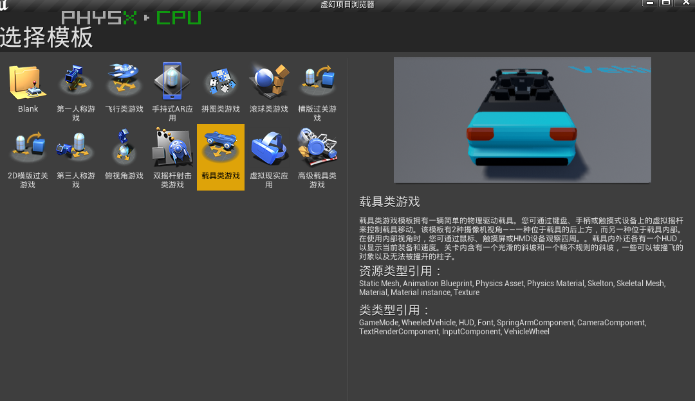
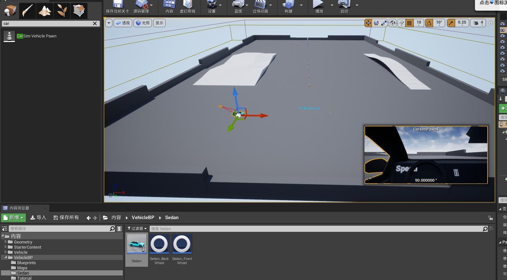

## 车辆动力学模块

[CarSIM - CARLA Simulator](https://carla.readthedocs.io/en/latest/tuto_G_carsim_integration/)

注意：carla与carsim的交互方式，是基于carsim的unreal插件，由于更新较快，此插件不同的版本对应不同的carsim版本，目前测试unreal4.24版本对应carsim2020.0可以支持，unreal4.26插件不支持carsim2020.0。

### 测试1

测试环境534564

| 工具     | 版本     |     |
| ------ | ------ | --- |
| unreal | 4.24.3 |     |
| carsim | 2020.0 |     |

步骤：

#### 1.unreal新建项目

选择vehicle模板，启用carsim插件，添加carsim Vehicle Pawn如图所示

<<<<<<< HEAD

=======

>>>>>>> eeaf897c7e076990d0aa506685f5e9b1b1c53370

#### 2.绑定车辆

将车辆模型拖动到组件BodyShapeOffset Component

#### 3.更改carsim动力学配置文件

<<<<<<< HEAD

=======

>>>>>>> eeaf897c7e076990d0aa506685f5e9b1b1c53370

#### 4.启动carsim或者licence manager

#### 5.carsim会将数据生成到指定文件夹如下

#### 6.启动carsim数据回放功能

### 测试2

测试环境

| 工具     | 版本     |     |
| ------ | ------ | --- |
| unreal | 4.26.2 |     |
| carsim | 2020.0 |     |
| carla  | 0.9.13 |     |
<<<<<<< HEAD
=======

>>>>>>> eeaf897c7e076990d0aa506685f5e9b1b1c53370
